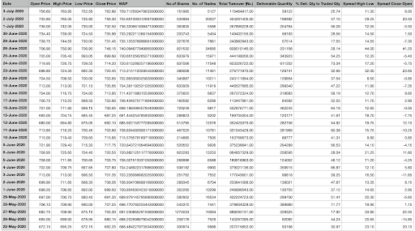
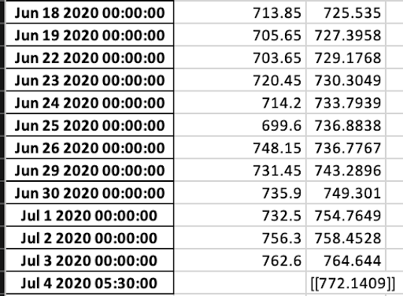
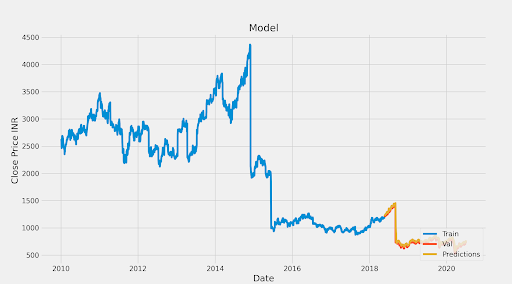
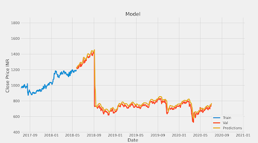

# Stock Price Prediction and Analysis Using LSTM and RNN

### Neural Networks
Neural networks are a set of algorithms that closely resemble the human brain and are designed to recognize patterns. They are capable of interpreting sensory data through regression and clustering of raw input. Neural networks require all real world data to be converted into vectors in order to recognize and spot numerical patterns in the data. Artificial Neural Networks consist of a large number of highly interconnected processing elements working together to solve a problem.

### Recurrent Neural Networks (RNN)
Recurrent Neural Network is a type of neural network in which the output from the previous step is fed as input to the next step. It is recurrent as the same function is performed for every input but the output for the current input depends upon the previous computation. The output in every iteration is copied and sent back into the recurrent network. The RNN makes decisions based on the current input and the output learnt from the previous input.
RNNs make use of their internal state (memory) to process a series of inputs. These are mainly used to model  sequence data such as time series. Schematically, an RNN layer uses a ‘for’ loop to iterate over the time steps of a sequence, while maintaining an internal state that encodes information about the timesteps it has seen so far.

### Long Short Term Memory (LSTM) Networks
Long Short Term Memory networks are a special type of recurrent neural networks that are capable of learning long term dependencies. They are well suited to classify, process and predict time series with given time lags of unknown duration. The model is trained by using back propagation. 
LSTM and RNN are therefore highly suitable for working with time series data given their ability to remember huge amounts of previous data.

### Modules and Technologies Used 
#### UI AND OTHER REQUIRED FILES
- <kbd>Tkinter (UI)</kbd>
- <kbd>Chrome Browser</kbd>
- <kbd>Chromedriver</kbd>

#### MODULES 
- <kbd>Selenium</kbd>
- <kbd>Threading</kbd> 
- <kbd>Os</kbd>
- <kbd>Pandas </kbd>
- <kbd>Numpy</kbd>
- <kbd>Scikit Learn</kbd> 
- <kbd>Keras</kbd>
- <kbd>Tensorflow</kbd>
- <kbd>Math</kbd> 
- <kbd>Datetime</kbd>
- <kbd>Xlswriter</kbd> 
- <kbd>Openpyxl</kbd>
- <kbd>Matplotlib</kbd>
##### NOTE - To download the dataset the chromedriver version should match the version of the Chrome browser installed on the system.
##### To run the software , simply run the GUI_Script.py file.

### Getting the Dataset
```
driver.execute_script(
"document.getElementById('ContentPlaceHolder1_txtFromDate').setAttribute('value', '01/01/2010')")
driver.find_element_by_id('ContentPlaceHolder1_btnDownload').click()

```

### Working of the Model
The CSV file that is downloaded is then converted into a pandas DataFrame. After that certain columns of data that are not needed are filtered from the dataframe. The only column that we process through the model is the Close Price. On the basis of the Close Price values of previous years we divide our training and testing set. We take about 80% of our dataset as the training set and the remaining 20% as testing set. MinMaxScalar is used from Scikit learn to scale the values so that the processing of such large numbers becomes easy.
###### The regFunc function from the regressionFunc.py file contains all the code for our model.

#### Generating Forecast Excel File 
Openpyxl and the xlswriter is used to generate the Forecast Excel file which contains the actual Close Prices and Predicted Close Prices according to our model.

###### The code segment for such generation of the Excel file is
```
with ExcelWriter('../Forecast_Excel/' + sec_no + '.xlsx',
                datetime_format='mmm d yyyy hh:mm:ss',
                date_format='mmmm dd yyyy', engine='xlsxwriter') as writer:
   valid[['Close Price','Predictions']].loc[for_excel:].to_excel(writer)
   workbook = writer.book
   worksheet = writer.sheets['Sheet1']
   format1 = workbook.add_format({'num_format': 'dd/mm/yy hh:mm:ss'})
   worksheet.set_column('A:A', 18, format1)
   worksheet.set_column('B:B', 14)
   writer.save()
   
```

###### The last row of the excel file contains the prediction of Close price for the upcoming day.

### Generating Graph
```
plt.figure(figsize=(16, 8))
plt.title('Model')
plt.xlabel('Date', fontsize=18)
plt.ylabel('Close Price INR ', fontsize=18)
plt.plot(train['Close Price'])
plt.plot(valid[['Close Price', 'Predictions']])
plt.legend(['Train', 'Val', 'Predictions'], loc='lower right')
plt.show()

```
## Results




# Read More about this model and it's working at
[Medium Blog](https://medium.com/stock-prediction/stock-prediction-using-python-and-ml-5a28d85c4001)
